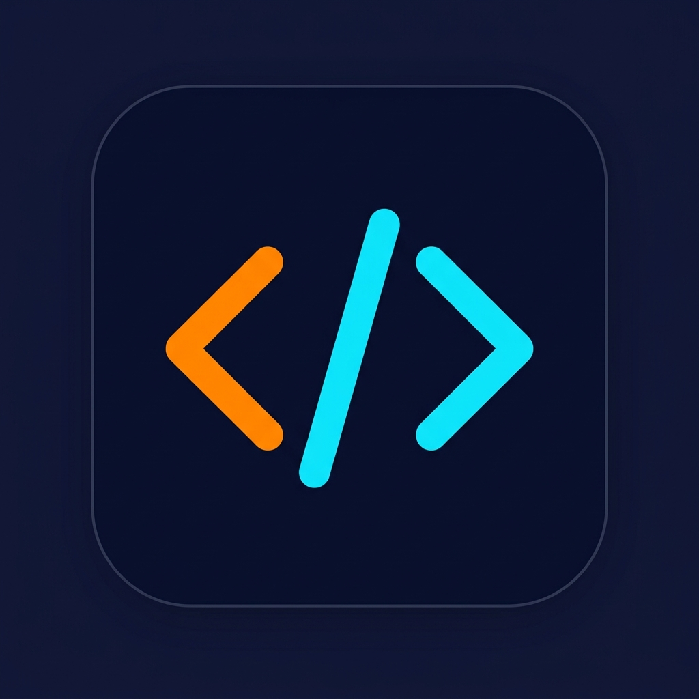
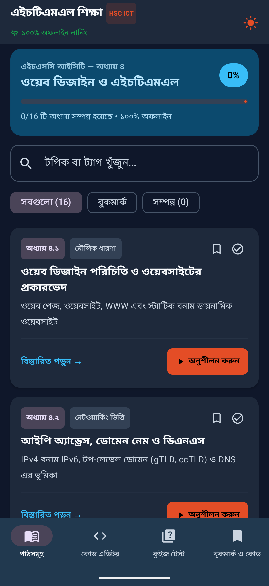
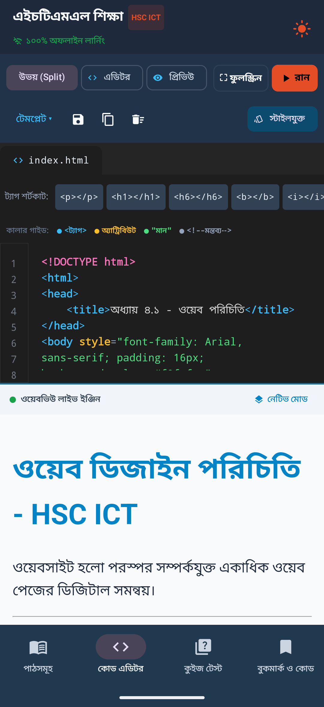
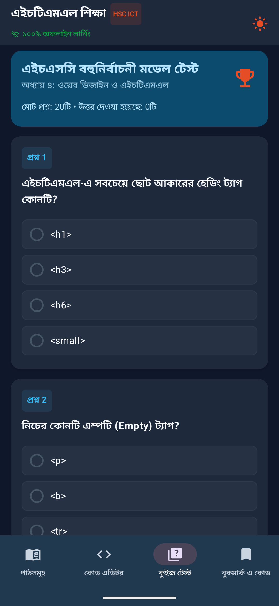
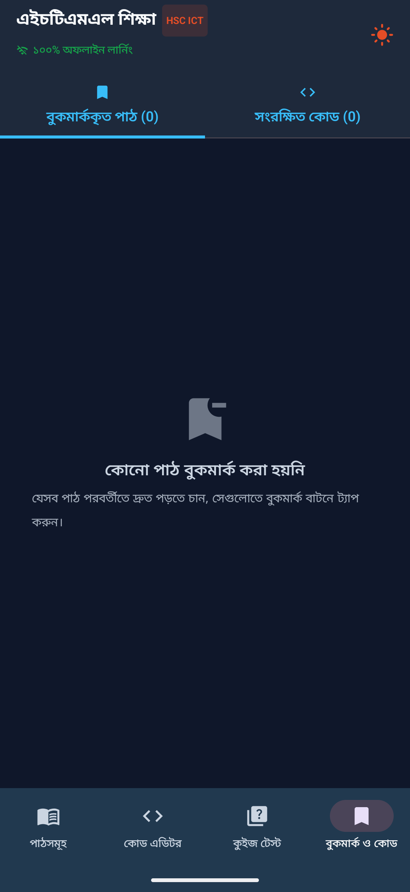

<div align="center">
  

  # HTML Bangla — এইচএসসি আইসিটি (HTML) শেখার অ্যাপ

  **A free, offline Android app that teaches HSC ICT Chapter 4 (Web Design & HTML) in Bengali — complete with a live split-view code editor, 21-question quiz engine, bookmarks, and progress tracking.**

  [](https://kotlinlang.org)
  [](https://developer.android.com/jetpack/compose)
  [](https://www.android.com)
  [](#-tech-stack)
  [](#-features)
  [](#-license)

</div>

---

## 📖 About

**HTML Bangla** is a native Android application built with **Kotlin** and **Jetpack Compose** that helps Bangladeshi HSC (Higher Secondary Certificate) students master the **ICT 4th Chapter — ওয়েব ডিজাইন পরিচিতি ও এইচটিএমএল (Web Design Introduction & HTML)** — entirely in **Bengali (বাংলা)**.

Instead of switching between a textbook, a code editor, and a browser, students get all three in one offline app: read a lesson, try the sample code in a live split-view HTML/CSS editor, preview the result instantly, and test their understanding with board-exam-style MCQs.

Perfect for HSC students, ICT tutors, and anyone who wants to **learn HTML in Bangla** without an internet connection.

> 🔎 **Keywords:** HSC ICT, HTML শেখার অ্যাপ, বাংলা এইচটিএমএল টিউটোরিয়াল, Android HTML learning app, offline coding app for students, HSC ICT chapter 4, web design Bangla tutorial, HTML code editor app, Jetpack Compose education app.

## 📑 Table of Contents

- [Features](#-features)
- [Screenshots](#-screenshots)
- [Curriculum Covered](#-curriculum-covered-hsc-ict-chapter-4)
- [Tech Stack](#-tech-stack)
- [Getting Started](#-getting-started)
- [Project Structure](#-project-structure)
- [Roadmap](#-roadmap)
- [Contributing](#-contributing)
- [License](#-license)
- [Author](#-author)

## ✨ Features

- 📚 **16 in-depth lessons** covering the full HSC ICT Chapter 4 syllabus, written in clear Bengali with board-question notes highlighted.
- 💻 **Live split-view code editor** — write HTML/CSS on one side and see an instant WebView preview on the other, with syntax highlighting.
- ✏️ **Practice code for every lesson** so students can run and tweak real examples straight from the textbook.
- 📝 **21-question quiz engine** with instant feedback and detailed explanations for every answer — great for exam revision.
- 🔖 **Bookmarks & saved snippets** — mark favorite lessons and save your own code snippets locally for later.
- 📈 **Progress tracking** that remembers completed and bookmarked lessons using a local Room database.
- 🌗 **Dark & light theme** support that follows the system theme or a manual toggle.
- 📴 **Fully offline** — all lesson content, code samples, and quizzes are bundled in the app; no internet connection required to study.
- 🇧🇩 **100% Bengali UI**, designed specifically for the Bangladesh HSC/NCTB ICT curriculum.
- 🎨 Modern **Material 3** design built entirely with Jetpack Compose.

## 📱 Screenshots

<!--
  Add real screenshots here for a much stronger, more SEO-friendly README.
  Suggested steps:
  1. Create a `screenshots/` folder at the repo root.
  2. Drop 3–5 PNGs there (Lessons list, Code Editor, Quiz, Saved/Bookmarks).
  3. Replace the placeholders below with, e.g.:
     
-->
<div align="center">
  
  
  
  
</div>

## 📚 Curriculum Covered (HSC ICT — Chapter 4)

| # | অধ্যায় | বিষয় (Topic) |
|---|---------|----------------|
| 1 | ৪.১ | ওয়েব ডিজাইন পরিচিতি ও ওয়েবসাইটের প্রকারভেদ |
| 2 | ৪.২ | আইপি অ্যাড্রেস, ডোমেন নেম ও ডিএনএস |
| 3 | ৪.৩ | ইউআরএল (URL) ও ওয়েব ব্রাউজিং আর্কিটেকচার |
| 4 | ৪.৪ | ওয়েবসাইটের কাঠামো (Website Structures) |
| 5 | ৪.৫ | এইচটিএমএল-এর পরিচিতি ও মৌলিক গঠন |
| 6 | ৪.৬ | টেক্সট ফরম্যাটিং, হেডিং ও অনুচ্ছেদ |
| 7 | ৪.৭ | এইচটিএমএল লিস্ট: ক্রম ও বুলেট |
| 8 | ৪.৮ | হাইপারলিংক সংযোজন (Hyperlink) |
| 9 | ৪.৯ | ইমেজ ও মাল্টিমিডিয়া উপাদান |
| 10 | ৪.১০ | এইচটিএমএল টেবিল ও সেল মার্জিং 🔥 |
| 11 | ৪.১১ | এইচটিএমএল ফর্ম ও ইউজার ইনপুট |
| 12 | ৪.১২ | ওয়েবসাইট ডিজাইনের ধাপসমূহ |
| 13 | ৪.১৩ | ওয়েবসাইট পাবলিশিং-এর ধাপসমূহ |
| 14 | ৪.১৪ | সার্চ ইঞ্জিন অপ্টিমাইজেশন (SEO) ও সার্চ ইঞ্জিন |
| 15 | ৪.১৫ | ওয়েবসাইট রক্ষণাবেক্ষণ ও ওয়েব নিরাপত্তা |
| 16 | ৪.১৬ | এইচএসসি বোর্ড স্পেশাল চূড়ান্ত গাইড ও সৃজনশীল টিপস |

Each lesson also ships with a ready-to-run practice example and key board-exam tips (`keyBoardTips`).

## 🛠️ Tech Stack

| Layer | Technology |
|---|---|
| Language | [Kotlin](https://kotlinlang.org) |
| UI Toolkit | [Jetpack Compose](https://developer.android.com/jetpack/compose) + Material 3 |
| Architecture | MVVM (`ViewModel` + `StateFlow`) |
| Local Storage | [Room](https://developer.android.com/training/data-storage/room) (progress & saved snippets) |
| Code Preview | Android `WebView` with a custom HTML syntax highlighter |
| Build System | Gradle (Kotlin DSL), KSP |
| Min SDK / Target SDK | 24 / 36 |

## 🚀 Getting Started

### Prerequisites

- [Android Studio](https://developer.android.com/studio) (latest stable)
- JDK 11+

### Installation

```bash
# 1. Clone the repository
git clone https://github.com/RuHRabin/html-bangla.git

# 2. Open the project folder in Android Studio
cd html-bangla
```

1. Let Android Studio sync the Gradle project and resolve dependencies automatically.
2. Connect an Android device or start an emulator (API 24+).
3. Click **Run ▶** to build and install the app.

No API keys or backend setup are required to run the core app — all lesson, quiz, and practice content ships locally with the app.

## 📂 Project Structure

```
html-bangla/
├── app/
│   └── src/main/java/com/example/
│       ├── data/            # Room entities, DAOs, and repository
│       ├── model/           # Lesson & quiz data models (HscLessons.kt)
│       ├── ui/
│       │   ├── screens/     # Lessons, Code Editor, Quiz, Saved screens
│       │   ├── theme/       # Compose theme (colors, typography)
│       │   └── util/        # HTML syntax highlighter
│       ├── viewmodel/       # MainViewModel (app state & business logic)
│       └── MainActivity.kt  # App entry point
└── gradle/                  # Gradle wrapper & version catalog
```

## 🗺️ Roadmap

- [ ] Add CSS & JavaScript focused chapters as separate modules
- [ ] Export saved code snippets as `.html` files
- [ ] In-app search across all lessons
- [ ] Add Play Store release
- [ ] Multi-language support (Bangla / English toggle)

Have an idea? Open an [issue](../../issues) or start a [discussion](../../discussions).

## 🤝 Contributing

Contributions, bug reports, and feature requests are welcome!

1. Fork the repository
2. Create your feature branch (`git checkout -b feature/amazing-feature`)
3. Commit your changes (`git commit -m 'Add amazing feature'`)
4. Push to the branch (`git push origin feature/amazing-feature`)
5. Open a Pull Request

## 📄 License

This project is available under the **MIT License** — see the [LICENSE](LICENSE) file for details. *(Add a `LICENSE` file to the repo root to make this official; MIT is recommended for open-source Android projects.)*

## 👤 Author

**Ruh Rabin**
GitHub: [@RuHRabin](https://github.com/RuHRabin)

---

<div align="center">

If this project helped you study for HSC ICT, consider giving it a ⭐ on GitHub — it helps other students find it too!

</div>
